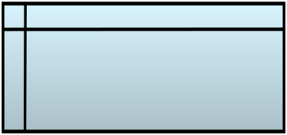
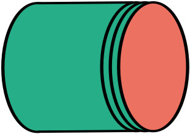
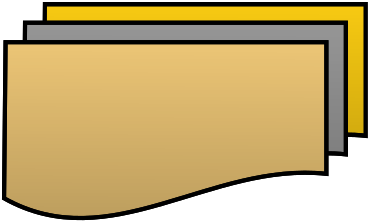
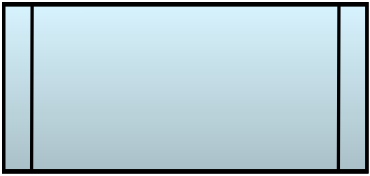
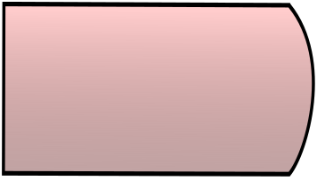
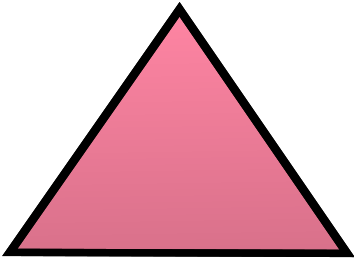
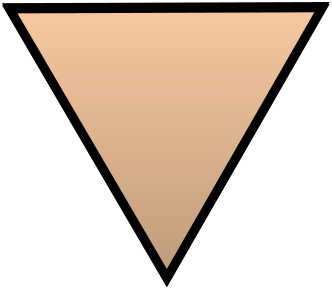

# Symboles d’organigramme

*Inspirée de « IBM flowcharting techniques », de la NORME INTERNATIONALE ISO 5807 et divers autres documents disponibles sur internet.*

# 1. Introduction

La présente Norme internationale reprend les informations figurant dans I’ISO 1028 et dans I’ISO 2636 et, de ce fait, les remplace.

Les organigrammes sont largement utilisés pour décrire tous les types de problèmes de traitement de l’information et les moyens de les résoudre. La présente Norme internationale ne limite pas leur emploi aux applications particulières citées à titre d’exemples.
Des règles internes doivent dans certains cas être élaborées en tenant compte des types de données ou de traitements en cours d’étude. Toutefois, il existe des principes directeurs qui, s’ils sont respectés, améliorent la lisibilité et facilitent les références croisées avec le texte.

Les organigrammes sont composés de symboles ayant une signification donnée, d’un texte explicatif bref et de lignes de raccordement. La présente Norme internationale ne traite pas de la partie textuelle des organigrammes. Toutefois, chaque symbole correspond à un nom (non abrégé si possible) significatif et non ambigu qui est toujours utilisé dans l’ensemble de la documentation.

Un organigramme peut être utilisé à différents niveaux de détail ; le nombre de niveaux dépend de l’importance et de la complexité du problème. Ce niveau de détail doit être choisi pour que les différentes parties ainsi que les relations existantes entre ces parties soient compréhensibles dans leur ensemble.

On définit généralement un organigramme reprenant l’ensemble du système et montrant les principaux éléments constitutifs ; cet organigramme représente le premier niveau de la hiérarchie ; chaque niveau d’en dessous donne une description plus détaillée d’une ou plusieurs des parties du schéma de niveau immédiatement supérieur.

# 2     Objet et domaine d’application

La présente Norme internationale précise les symboles à utiliser dans la documentation du traitement de l’information et énumère des règles générales sur les conventions de leur emploi dans :
a)    Les organigrammes des données ;
b)    Les organigrammes de programmation ;
c)    Les organigrammes d’analyse ;
d)    Les schémas des réseaux des programmes ;
e)    Les schémas des ressources de systèmes.

# 3     Références

ISO 2382/1, Traitement de l’information - Vocabulaire - Chapitre 01: Termes fondamentaux.

# 4     Définitions

Dans le cadre de la présente Norme internationale, les définitions de I’ISO 2382/1 et les définitions suivantes sont applicables.

## 4.1   Symbole de base :

 Symbole utilisé lorsque la forme ou la nature précise du traitement ou du support des données (par exemple) est inconnue, ou lorsqu’elle est inutile pour décrire le support réel.

## 4.2   Symbole spécifique :

 Symbole utilisé lorsque la nature précise ou la forme (par exemple) du traitement ou du support des données est connue et qu’elle est nécessaire pour décrire le support réel.

## 4.3   Organigrammes :

 Représentation graphique de la définition, de l’analyse ou de la méthode de résolution d’un problème dans laquelle des symboles sont utilisés pour représenter des opérations, des données, des flux, des équipements, etc.

# 5     Organigramme des données

L’organigramme des données représente le cheminement des données dans la résolution d’un problème et définit les étapes du traitement ainsi que les différents supports utilisés pour les données.
Un organigramme de données se compose des éléments suivants :
a)    Symboles de données pour indiquer l’existence des données ; ces symboles peuvent également préciser le support utilisé pour ces données ;
b)    Symboles de traitement pour indiquer les opérations à exécuter sur les données ; ces symboles peuvent également préciser les éléments machine utilisés pour ces traitements;
c)    Lignes de liaison pour indiquer la circulation des données entre traitements et/ou supports des données ;
d)    Symboles spéciaux de l’organigramme pour faciliter la lecture et l’écriture de l’organigramme.
Par définition, les symboles de traitement doivent être précédés et suivis par des symboles de données. Un organigramme de données commence et se termine par des symboles de données (à l’exception des symboles spéciaux décrits en 9.4).

# 6     Organigramme de programmation

L’organigramme de programmation représente l’enchaînement des opérations d’un programme.
Un organigramme de programmation se compose des éléments suivants :

a)    Symboles de traitement pour les éléments de traitement proprement dits, y compris les symboles définissant le chemin à suivre en tenant compte des conditions logiques ;
b)    Lignes de liaison pour indiquer le flux des contrôles ;
c)    Symboles spéciaux pour faciliter la lecture et l’écriture de l’organigramme.

# 7     Organigramme d’analyse

L’organigramme d’analyse représente le contrôle des opérations et la circulation des données à l’intérieur d’un système.
L’organigramme d’analyse se compose des éléments suivants :
a)    Symboles de données pour indiquer l’existence de données ; ces symboles peuvent également spécifier le support utilisé pour ces données ;
b)    Symboles de traitement pour indiquer les opérations à exécuter sur les données et pour définir le chemin logique à suivre ;
c)    Lignes de liaison pour indiquer la circulation des données entre traitements et/ou supports de données, ainsi que le flux des contrôles entre traitements ;
d)    Symboles spéciaux pour faciliter la lecture et l’écriture de l’organigramme.

# 8     Schéma de réseau de programme

Le schéma de réseaux de programmes représente le cheminement des activations de chaque programme et les interactions vis-à-vis des données concernées. Chaque programme d’un schéma de ce type n’apparaît qu’une fois alors que dans un organigramme d’analyse, il peut être présent dans plusieurs flux de contrôle.
Un schéma de réseau de programme se compose des éléments suivants :
a)    Symboles de données pour indiquer l’existence des données ;
b)    Symboles de traitement exécuter sur les données ;
c)    Lignes de liaison pour indiquer la circulation entre processus et données ainsi que les activations des traitements ;
d)    Symboles spéciaux pour faciliter la lecture et l’écriture des schémas de réseaux.

# 9     Schéma des ressources de système

# 10       Symboles

## 10.1  Symboles de données

### 10.1.1              Symboles de base

#### 10.1.1.1            Données

Ce symbole représente des données dont le support n’est pas spécifié.

#### 10.1.1.2            Données mémorisées

Ce symbole représente des données mémorisées sous une forme convenant pour leur traitement, le support n’étant pas spécifié.

### 10.1.2              Symboles spécifiques

#### 10.1.2.1            Mémoire interne

Ce symbole représente des données, le support utilisé étant la mémoire interne.

#### 10.1.2.2            Mémoire à accès séquentiel

Ce symbole représente des données qui peuvent seulement être consultées en accès séquentiel, le support étant par exemple une bande magnétique, une cartouche de bande ou une cassette magnétique.

#### 10.1.2.3            Mémoire à accès direct

Ce symbole représente des données accessibles directement, le support étant par exemple un disque magnétique, un tambour ou une disquette.

#### 10.1.2.4            Document/documents

Ce symbole représente des données lisibles par l’homme, le support étant par exemple un état réalisé par imprimante, un document en OCR ou MICR, un microfilm, une bande de comptage, des imprimés de saisie de données.

#### 10.1.2.5            Entrée manuelle

Ce symbole représente des données, le support étant l’un de ceux pour lesquels l’information est entrée manuellement au moment du traitement, par exemple clavier en ligne, positionnement d’interrupteurs, poussoirs, crayons lumineux, sonde de lecture de code à barres.

#### 10.1.2.6            Opération de Saisie

#### 10.1.2.7            Carte

Ce symbole représente des données, le support étant constitué de cartes, par exemple cartes perforées, cartes magnétiques, cartes à lecture graphique, cartes à talons, cartes à marques optiques.

#### 10.1.2.8            Bande perforée

Ce symbole représente des données, le support étant une bande de papier.

#### 10.1.2.9            Affichage

Ce symbole représente des données, le support étant l’un quelconque de ceux sur lesquels les informations sont affichées à l’intention de l’homme, par exemple écrans vidéo, voyants en ligne.

## 10.2  Symboles de traitement

### 10.2.1              Symbole de base

#### 10.2.1.1            Traitement

Ce symbole représente une partie quelconque de traitement, par exemple exécution d’une opération définie ou d’un groupe d’opérations produisant une codification de la valeur, de la forme ou de la position d’informations, ou la détermination de la direction suivie parmi toutes les directions possibles.

### 10.2.2              Symboles de traitements particuliers

#### 10.2.2.1            Traitement prédéterminé

Ce symbole représente un traitement nommé composé d’une ou plusieurs opérations ou pas de programme spécifié par ailleurs, par exemple : un sous-programme, un module.

#### 10.2.2.2            Opération manuelle

Ce symbole représente tout traitement exécuté par un opérateur humain.

#### 10.2.2.3            Préparation

Ce symbole représente la modification d’une instruction ou d’un groupe d’instructions pour effectuer une activité ultérieure, par exemple le positionnement d’une bascule ou d’un interrupteur, la modification d’un registre d’index ou l’initialisation d’une routine.

#### 10.2.2.4            Décision

Ce symbole représente une fonction de type sélection ou décision comportant une seule entrée mais pour laquelle existent plusieurs sorties possibles, dont une seule peut être activée après l’évaluation des conditions définies dans le symbole. Les résultats de l’évaluation peuvent être écrits à côté des lignes représentant les chemins possibles.

#### 10.2.2.5            Symbole de commencement ou de terminaison

Ce symbole indique le début ou la fin d’un enchainement d’actions (ou algorithme).

#### 10.2.2.6            Travail en parallèle

Ce symbole représente la synchronisation de deux opérations ou plus, fonctionnant en parallèle.

Exemple :

#### 10.2.2.7            Limite de boucle

Ce symbole en deux parties représente le début et la fin d’une boucle. Les deux parties du symbole ont le même identificateur. Les conditions d’initialisation, d’incrémentation, d’achèvement, etc., sont dans le symbole de début ou de fin, suivant la position de l’opération de test.

Exemple :

#### 10.2.2.8            Délai, retard, pause

## 10.3  Symboles de représentation des lignes

*(Symboles linéaires)*

### 10.3.1              Symbole de base

Ligne de liaison
Ce symbole représente la circulation des données ou du contrôle.

### 10.3.2              Symboles spécifiques

#### 10.3.2.1            Transfert de contrôle

Ce symbole représente un transfert immédiat du contrôle d’un traitement à un autre, parfois avec un risque de retour direct au traitement d’activation après l’achèvement des opérations du traitement activé. Le type de transfert de contrôle doit être inscrit dans le symbole ; exemple : appel, recherche, événement.

#### 10.3.2.2            Ligne de télécommunications

Ce symbole représente le transfert de données par une ligne de télécommunications.

#### 10.3.2.3            Tirets

Ce symbole représente une autre relation possible entre deux symboles ou davantage.  II est également utilisé pour entourer une annotation.

Exemples :
Lorsqu’une sortie parmi plusieurs traitements possibles est utilisée comme entrée pour un traitement, ou bien quand une sortie est utilisée comme entrée pour d’autres traitements possibles, ces symboles sont reliés par des lignes composées de tirets.

## 10.4  Autres symboles

Commentaire

Branchement

Connecteur

Extraction

Fusion

Hors page

En page

Ou

Tri

Bande de transmission (?)

